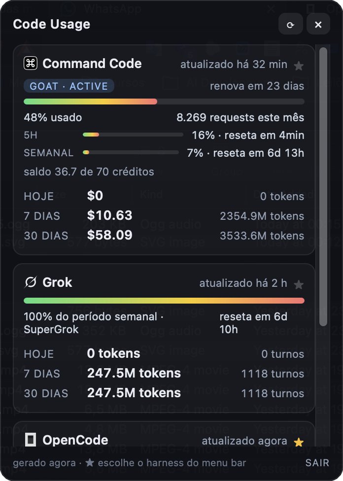
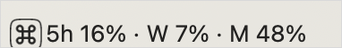

# Code Usage

[](https://github.com/puppe1990/code-usage/actions/workflows/frontend.yml)
[](https://github.com/puppe1990/code-usage/actions/workflows/rust.yml)

A macOS menu bar app that shows your usage for **Command Code**, **Grok** and **OpenCode** in one place.





- **Menu bar title:** **one** harness at a time — the ★ in the panel is a single choice (default: Command Code; clicking the active star clears it and leaves only the icon). The chosen harness shows the plan windows it has, each labelled: `5h` for the rolling/five-hour window, `W` for the weekly one and `M` for the monthly one, in that order — Grok gives `W 100%`, Command Code `5h 12% · W 5% · M 46%` (its billing period is monthly, so `M` is the plan percentage shown in the dashboard) and OpenCode Go `5h 20% · W 25% · M 12%`. When a harness has no window data (limits unavailable, no subscription) the title falls back to today's cost, and missing data renders as `–`
- **Menu bar mark:** the selected harness also picks the icon — each harness shows its own mark (Command Code, Grok, OpenCode) and the icon-only state keeps the gauge; the panel card headers repeat the same marks
- **Click the icon:** a panel with one collapsible card per harness — the plan limits (the Grok weekly window; the Command Code plan, percentage used, requests, renewal and the 5-hour/weekly windows; the OpenCode Go rolling / weekly / monthly windows) are always visible, and clicking the card header reveals that harness' today / 7 days / 30 days totals with tokens (input, output, cache)
- **Local by default:** costs and tokens come only from the files each CLI already writes to disk. The only network calls read your plan limits (Command Code and OpenCode Go) using credentials the CLIs themselves store — see below.

## Data sources

| Provider                   | Source                                                                                                  | What is read                                                                                                                                                                                       |
| -------------------------- | ------------------------------------------------------------------------------------------------------- | -------------------------------------------------------------------------------------------------------------------------------------------------------------------------------------------------- |
| Command Code               | `~/.commandcode/projects/<slug>/<session>.jsonl`                                                        | assistant message lines with `usage.costUsd` and tokens                                                                                                                                            |
| Command Code (plan limits) | `api.commandcode.ai` — `/alpha/usage/summary`, `/alpha/billing/credits`, `/alpha/billing/subscriptions` | plan, percentage used, period requests, credit balance and the 5-hour/weekly windows (the same endpoints the CLI's `/usage` uses, authenticated with the `apiKey` from `~/.commandcode/auth.json`) |
| Grok                       | `~/.grok/logs/unified.jsonl`                                                                            | `billing: fetched credits config` events (period percentage) and `shell.turn.inference_done` (tokens)                                                                                              |
| OpenCode                   | `~/.local/share/opencode/opencode.db` (SQLite, read-only)                                               | `message` table, JSON payload with `cost` and `tokens`                                                                                                                                             |
| OpenCode Go (plan limits)  | `opencode.ai/zen/go/v1/usage`                                                                           | the `usage.rolling` / `usage.weekly` / `usage.monthly` windows (percentage and reset instant), authenticated with the `opencode-go` API key from `~/.local/share/opencode/auth.json`               |

Paths can be overridden with environment variables: `CODE_USAGE_CC_ROOT`, `CODE_USAGE_GROK_LOG`, `CODE_USAGE_OPENCODE_DB`, `CODE_USAGE_CC_AUTH`, `CODE_USAGE_CC_API_BASE`, `CODE_USAGE_OPENCODE_AUTH`, `CODE_USAGE_OPENCODE_GO_URL`.

## Limitations (by design of each CLI)

- **Command Code (plan limits)** uses the CLI's internal API — it is an `alpha` endpoint with no public contract and can change without notice. Limits are fetched at most every 5 minutes; if the request fails the app keeps the last known values (or simply hides that block) and keeps working with local data.
- **OpenCode Go (plan limits)** reads the usage endpoint the OpenCode clients use (undocumented, may change). Same 5-minute cache and same graceful fallback as above; without an `opencode-go` key in `auth.json` the block is simply not shown.
- **Grok** only refreshes the percentage when the CLI runs; the panel shows "updated X ago" based on the latest event.
- **OpenCode** does not compute a cost for every message (messages without `cost` count as $0, but their tokens still count).

## Behavior

- The tray title refreshes every **60s** and the panel receives each new snapshot through an event.
- The ★ stars are saved to `~/Library/Application Support/code-usage/preferences.json` (override with `CODE_USAGE_CONFIG`). With no star selected the menu bar shows the icon only.
- **abrir ao iniciar o Mac** registers the app as a login item (`tauri-plugin-autostart`, a LaunchAgent) and shows whatever the system currently has — it is the same switch as System Settings → General → Login Items.
- Clicking the icon toggles the panel; it is positioned right below the icon and hides when it loses focus (Esc also closes it).
- The icon has no native menu: on macOS a menu attached to the status item would open on any click and block the popover, so **Refresh** and **Quit** live inside the panel.
- The whole snapshot is recomputed on every cycle: Command Code reads the transcripts (~90 files), Grok reads the CLI log and OpenCode runs a read-only `SELECT` on the `message` table.
- If a CLI is not installed, its card shows "not found" and the tray title shows `–` in that slot.

## Development

```bash
npm install          # the repo ships .npmrc with include=dev so devDependencies are always installed
npm run tauri dev    # app running in the menu bar (vite on port 1421)
cargo test           # Rust tests (parsers, time windows, tray title) — run inside src-tauri/
cargo test -- --ignored --nocapture   # smoke test against the real data on this machine
npm test             # frontend tests (Vitest)
```

Port 1421 is used for dev because 1420 is taken by another local project. The window needs the `core:default` capability in `src-tauri/capabilities/default.json` to use `listen`/`invoke`.

## Quality (prettier, tests and CI)

Nothing runs "always": both the pre-commit hook and CI only execute what the diff touches.

- `npm run format` formats everything with prettier (`npm run format:check` only verifies).
- **pre-commit** in `.githooks/pre-commit`, installed automatically by `npm install` (a `prepare` script sets `core.hooksPath`):
  - `prettier --check` only on the files in the commit;
  - frontend tests (vitest) only when something under `src/` or in the build configs changes;
  - `cargo test --release` only when `src-tauri/**` changes.
  - To skip everything: `SKIP_PRECOMMIT=1 git commit ...` (or `git commit --no-verify`).
- **CI** is split into two path-filtered workflows:
  - `.github/workflows/frontend.yml` (ubuntu): prettier, `tsc --noEmit` and vitest — triggers on changes to `src/**` or the build configs;
  - `.github/workflows/rust.yml` (macOS, with cargo caching): `cargo fmt --all --check`, `cargo clippy --all-targets -- -D warnings` and `cargo test` — triggers only on changes to `src-tauri/**`.
  - In other words: a README-only change runs no CI, and a frontend change never pays for the ~1-6 min Rust job.

To regenerate the icons (drawn in `scripts/generate-icons.mjs`, which rasterizes each harness mark from its SVG in `src-tauri/icons/` through `scripts/svg-mark.mjs`):

```bash
node scripts/generate-icons.mjs
npm run tauri -- icon src-tauri/icons/source.png
```

## Build and install

```bash
npm run tauri build
cp -R "src-tauri/target/release/bundle/macos/Code Usage.app" /Applications/
```

The app runs with no Dock icon (`ActivationPolicy::Accessory`); to quit, use the **Sair** button in the panel footer. To launch it at login, tick **abrir ao iniciar o Mac** in the panel.

## Architecture

- `src-tauri/src/usage/` — pure, testable parsers (`commandcode.rs`, `grok.rs`, `opencode.rs`), time windows (`window.rs`) and tray title formatting (`tray_title.rs`)
- `src-tauri/src/tray.rs` — menu bar mark (the gauge, or the Command Code logo while that harness is selected) and popover positioning
- `src-tauri/src/refresh.rs` — 60s recompute loop plus the event sent to the panel
- `src/` — the panel in plain TypeScript (Vite), with formatting helpers covered by Vitest
